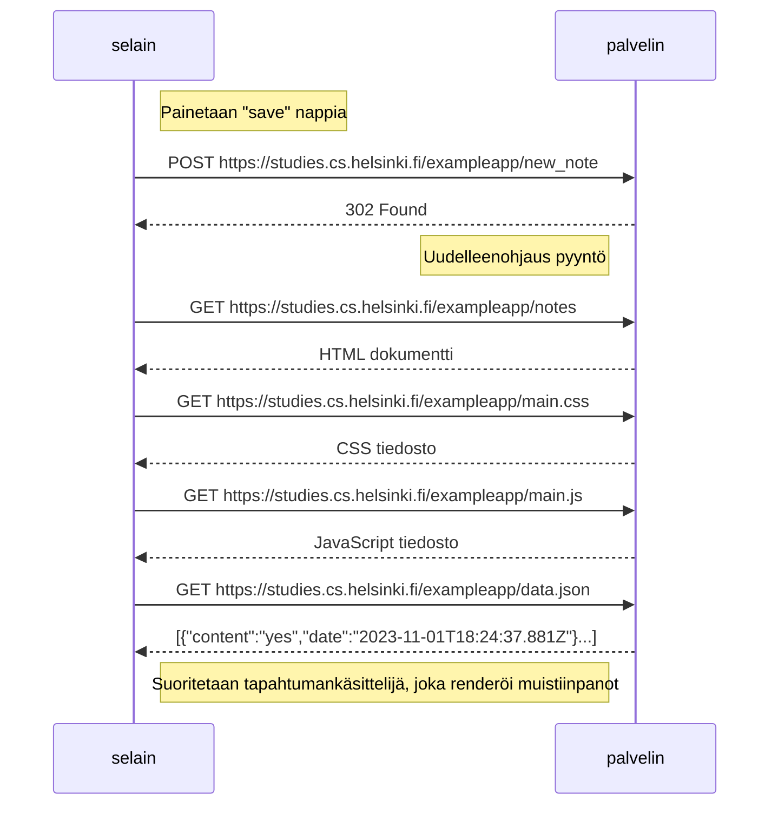

```mermaid
sequenceDiagram
    participant selain
    participant palvelin

    Note right of selain: Painetaan "save" nappia
    
    selain->>palvelin: POST https://studies.cs.helsinki.fi/exampleapp/new_note
    palvelin-->>selain: 302 Found

    Note left of palvelin: Uudelleenohjaus pyyntö
  
    selain->>palvelin: GET https://studies.cs.helsinki.fi/exampleapp/notes
    palvelin-->>selain: HTML dokumentti

    selain->>palvelin: GET https://studies.cs.helsinki.fi/exampleapp/main.css
    palvelin-->>selain: CSS tiedosto

    selain->>palvelin: GET https://studies.cs.helsinki.fi/exampleapp/main.js
    palvelin-->>selain: JavaScript tiedosto

    selain->>palvelin: GET https://studies.cs.helsinki.fi/exampleapp/data.json
    palvelin-->>selain: [{"content":"yes","date":"2023-11-01T18:24:37.881Z"}...]
    Note right of selain: Suoritetaan tapahtumankäsittelijä, joka renderöi muistiinpanot
```
