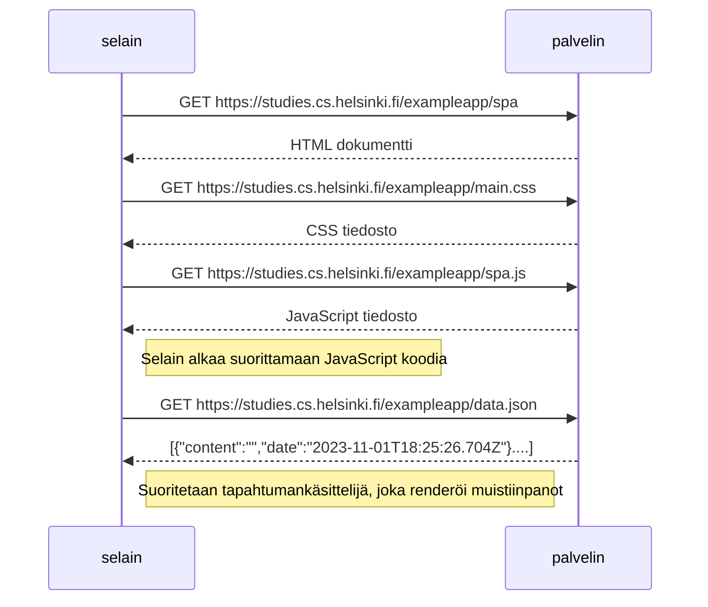

```mermaid
sequenceDiagram
    participant selain
    participant palvelin
    
    selain->>palvelin: GET https://studies.cs.helsinki.fi/exampleapp/spa
    palvelin-->>selain: HTML dokumentti

    selain->>palvelin: GET https://studies.cs.helsinki.fi/exampleapp/main.css
    palvelin-->>selain: CSS tiedosto

    selain->>palvelin: GET https://studies.cs.helsinki.fi/exampleapp/spa.js
    palvelin-->>selain: JavaScript tiedosto

    Note right of selain: Selain alkaa suorittamaan JavaScript koodia

    selain->>palvelin: GET https://studies.cs.helsinki.fi/exampleapp/data.json
    palvelin-->>selain: [{"content":"","date":"2023-11-01T18:25:26.704Z"}....]
    
    Note right of selain: Suoritetaan tapahtumankäsittelijä, joka renderöi muistiinpanot

```
